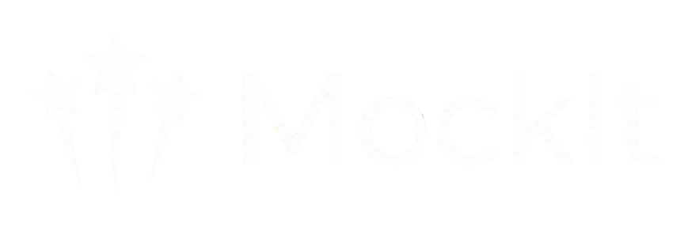

# MockIt 🤖

**Your Personal AI Interview Coach**

MockIt is an advanced AI-powered mock interview platform designed to help job seekers practice, refine, and master their interview skills. Built with **Next.js**, it leverages **Google's Gemini AI** to generate personalized interview questions and provide real-time feedback.

**Live link:** https://mockit-tau.vercel.app/



## 🚀 Features

-   **🔐 Secure Authentication:** Seamless login and signup via **Clerk**.
-   **🤖 AI-Generated Interviews:** Generates tailored interview questions based on Job Role and Tech Stack using **Gemini AI**.
-   **🗣️ Speech-to-Text:** Interactive interview experience with voice recording.
-   **📊 Instant Feedback:** Detailed analysis of your answers with ratings and improvement suggestions.
-   **💾 History & Analytics:** Save and review past interview performance via PostgreSQL.
-   **🎨 Responsive Design:** Beautiful UI built with Tailwind CSS and Shadcn UI.

## 🛠️ Tech Stack

-   **Frontend:** [Next.js 14](https://nextjs.org/) (App Router)
-   **Styling:** Tailwind CSS, Shadcn UI
-   **Authentication:** [Clerk](https://clerk.com/)
-   **AI Engine:** [Google Gemini API](https://ai.google.dev/)
-   **Database:** PostgreSQL (via [Neon](https://neon.tech/))
-   **ORM:** [Drizzle ORM](https://orm.drizzle.team/)
-   **Icons:** Lucide React

## ⚙️ Getting Started

Follow these steps to set up the project locally.

### 1. Clone the repository

```bash
git clone [https://github.com/mufaddalvirpur/MockIt-AiMockInterviewer.git](https://github.com/mufaddalvirpur/MockIt-AiMockInterviewer.git)
cd mockit
```

### 2. Install dependencies

```bash
npm install
# or
yarn install
```

### 3. Setup Environment Variables
Create a .env.local file in the root directory and add the following keys:
```bash
# Clerk Authentication
NEXT_PUBLIC_CLERK_PUBLISHABLE_KEY=your_clerk_publishable_key
CLERK_SECRET_KEY=your_clerk_secret_key
NEXT_PUBLIC_CLERK_SIGN_IN_URL=/sign-in
NEXT_PUBLIC_CLERK_SIGN_UP_URL=/sign-up

# Database (Neon + Drizzle)
NEXT_PUBLIC_DRIZZLE_DB_URL=your_neon_postgresql_connection_string

# Google Gemini AI
NEXT_PUBLIC_GEMINI_API_KEY=your_google_gemini_api_key

# App Config
NEXT_PUBLIC_INTERVIEW_QUESTION_COUNT=5
NEXT_PUBLIC_INFORMATION=
```
### 4. Push Schema to Database
Use Drizzle Kit to push your schema changes to the Neon PostgreSQL database.
```bash
npm run db:push
```
### 5. Run the application
```bash
npm run dev
```
Open http://localhost:3000 with your browser to see the result.

### 📂 Project Structure
```bash
mockit/
├── app/                  # Next.js App Router pages
├── components/           # Reusable UI components
├── utils/                # Utility functions
│   ├── db.js             # Drizzle DB connection
│   ├── schema.js         # Database schema definitions
│   └── GeminiAI.js       # AI Model configuration
├── public/               # Static assets
└── ...
```

### 📄 License
This project is licensed under the MIT License.

### 📧 Contact
Mufaddal Virpurwala - GitHub Profile

Project Link: https://github.com/mufaddalvirpur/MockIt-AiMockInterviewer
